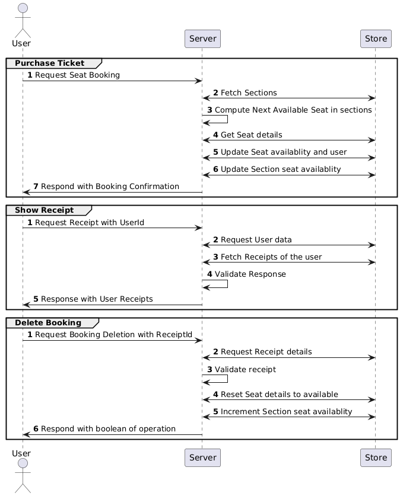

# Train Booking Project

This project is a gRPC-based application for managing seat bookings in a train reservation system. It provides functionality for booking, updating, and canceling seat reservations, as well as retrieving user receipts and seat availability.

## Features

- **Purchase Booking**: Allocate seats to users based on availability.
- **Update Seat Booking**: Update an existing booking with a new seat.
- **Delete Booking**: Cancel a booking and release the seat.
- **Receipt Management**: Retrieve and display user receipts.
- **Seat Availability**: Check and manage seat availability in different sections.

## Project Structure

- `cmd/server/service/booking.go`: Contains the core gRPC service logic for handling seat bookings and user interactions.
- `pkg/store/store.go`: Provides helper functions for interacting with the in-memory data store, such as retrieving sections, seats, users, and receipts.
- `cmd/server/models`: Defines the data models used in the application.
- `cmd/server/main.go`: The entry point for the gRPC server, initializing the service and starting the server.
- `cmd/server/proto/booking.proto`: The Protocol Buffers definition for the gRPC service, defining the RPC methods and message types used in the application.

## Data Models
- User: Represents a user with details like Id, First Name, Last Name and Email.
- Seat: Represents a seat with details like ID, Seat Availability , Section Id , Section Name and associated user.
- Section: Represents a train section with details like ID, name, and available seats.
- Receipt: Represents a booking receipt with details like ID, From , To, Email, seat, section, and booking status.

## gRPC Methods

### Update Seat Booking
**Method**: `UpdateSeatBooking`  
**Description**: Updates an existing booking by assigning a new seat to the user.  
**Request**:
- `ReceiptId` (string): The ID of the receipt to update.
- `NewSeatId` (string): The ID of the new seat to allocate.  
- `NewsectionId` (string): The ID of the new section to allocate the seat in.
  **Response**:
- `UpdatedReceipt` (object): Contains the updated receipt details, including the new seat and section information.

---

### Allocate Seat
**Method**: `PurchaseBooking`  
**Description**: Automatically allocates the next available seat to a user based on seat availability.  
**Request**:
- `User` (object): The user details for whom the seat is being allocated.
- `From` (string): The details of users boarding point.
- `To` (string): The details of users destination point.
- `PricePaid` (float) : Price paid by the user.
  **Response**:
- `Receipt` (object): Contains details including seat , section , price paid and Booking status information.

---

### Cancel Booking
**Method**: `DeleteBooking`  
**Description**: Cancels an existing booking and marks the seat as available.  
**Request**:
- `ReceiptId` (string): The ID of the receipt to cancel.  
  **Response**:
- `DeleteStatus` (boolean): Indicates whether the cancellation was successful.

---

### Retrieve Receipts
**Method**: `ShowReceipts`  
**Description**: Retrieves all booking receipts for a specific user.  
**Request**:
- `UserId` (string): The ID of the user whose receipts are to be retrieved.  
  **Response**:
- `Receipts` (array): A list of receipts containing details like seat, section, and booking status.

---

### Get Section Booking Details
**Method**: `GetSectionBookingDetails`  
**Description**: Retrieves booking details for all seats in a specific section.  
**Request**:
- `SectionId` (string): The ID of the section to retrieve booking details for.  
  **Response**:
- `SeatBookings` (array): A list of seat booking details, including user and seat information.

### Diagram - Sequence

